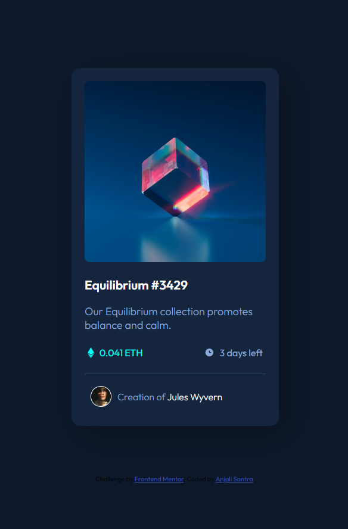

# Frontend Mentor - NFT preview card component solution

This is a solution to the [NFT preview card component challenge on Frontend Mentor](https://www.frontendmentor.io/challenges/nft-preview-card-component-SbdUL_w0U). Frontend Mentor challenges help you improve your coding skills by building realistic projects.

## Table of contents

- [Overview](#overview)
- [The challenge](#the-challenge)
- [Screenshot](#screenshot)
- [Links](#links)
- [Built with](#built-with)
- [What I learned](#what-i-learned)
- [Author](#author)

## Overview

This HTML & CSS only challenge is perfect for anyone just starting out or anyone wanting a small project to play around with.

### The challenge

Users should be able to:

- View the optimal layout depending on their device's screen size
- See hover states for interactive elements

### Screenshot



### Links

- Solution URL:(https://github.com/Anjali1-santra/NFT-preview-card-component)
- Live Site URL:(https://anjali-nft-preview-card-component.netlify.app)

### Built with

- Semantic HTML5 markup
- CSS custom properties
- Flexbox
- Mobile-first workflow
- Sass(CSS Preprocessor)


### What I learned

I Learned how to create an image overlay icon effect on hover.

```Scss
.overlay-container:hover .overlay {
    opacity: 0.5;
    cursor: pointer;
}
        
.overlay-container:hover .view {
    opacity: 1;
    cursor: pointer;
}
        
.overlay-container {
    width: 100%;
    max-width: 20rem;
    position: relative;
        
    img#equilibrium {
        width: 100%;
        height: auto;
        border-radius: 0.5rem;
        margin-bottom: 0.9375rem;
        display: block;
}
        
    .overlay {
        border-radius: 0.5rem;
        position: absolute;
        top: 0;
        bottom: 0;
        left: 0;
        right: 0;
        height: 100%;
        width: 100%;
        opacity: 0;
        transition: .3s ease;
        background-color: hsl(178, 100%, 50%);
    }
        
    img.view {
       position: absolute;
       top: 50%;
       left: 50%;
       transform: translate(-50%, -50%);
       transition: .3s ease;
       opacity: 0;
    }
}
```

## Author

- Frontend Mentor - [Anjali Santra](https://www.frontendmentor.io/profile/Anjali1-santra)

